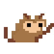

<h2> Howdy Partner, I'm Landon Johnson! </h2>


<p><em>Fullstack Developer @ <a href="https://ljtech.ca/">ljtech
</a> 
</em></p>

[](https://ljtech.ca/)
[](https://www.linkedin.com/in/ljtechdotca/)
[](https://twitter.com/intent/follow?screen_name=ljtechdotca)


###   Welcome to my GitHub Profile!
I love connecting with different people, thats one of the main reasons why I love streaming. If you wish to say "hey", I'll be happy to meetup for a chat!

###  A little more about me...

```javascript
const landon = {
    pronouns: ["He", "Him"],
    currentFocus: "Working on personal projects.",
    interests: ["Carpentry", "Coding", "Gardening"],
    languages: ["CSS", "HTML", "JavaScript", "TypeScript", "C#"],
};
```
